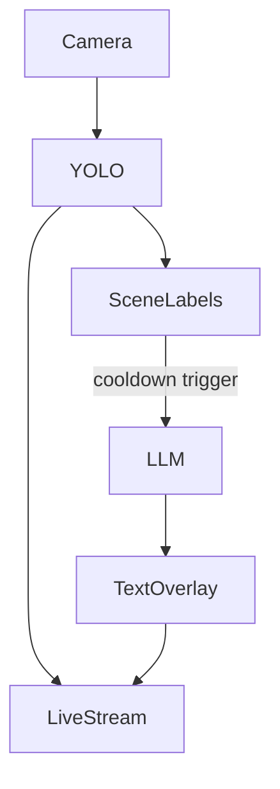

> **School of Tomorrow's AI note:** I went to an install fest expecting to test a local LLM. I came back thinking about timing, hardware misunderstandings, and the strange gap between a machine that sees quickly and one that answers slowly.

**TL;DR** — I wanted to know whether a borrowed Raspberry Pi 5 could run local AI in a meaningful way. It could — but only if I stopped imagining “local AI” as one smooth thing and started seeing it as a choreography of different speeds, different layers, and very specific hardware limits.

## The hook

At **AI @ SGMK**, the room itself was already an argument. People were showing up with different devices, different expectations, and different thresholds for what counted as “working.” There was a MacBook M4 in the mix, a Jetson, a Radxa Rock 5b, and, in my case, a **Raspberry Pi 5 borrowed from Sarah**. The workshop page framed local AI as a way to take more control over your data, but what made the session interesting to me was not the political framing alone. It was the very practical question of what these machines could actually sustain, once you stopped talking about models in the abstract and started asking them to do something.

I began with the most direct test I could think of: install Ollama, run a local model, and ask it a dumb question.

TinyLlama answered *“how to pass an elephant through the door?”* with the sincere confidence of a machine trying very hard to be helpful. Gemma 2B answered the same question more like a riddle engine, immediately reframing it as a trick about literal thinking. Both responses were interesting. Both ran locally. Both made me think: okay, maybe this is enough to start.

Then I tried an 8B Apertus model, and the mood changed. The Raspberry Pi did not simply “get slower.” It became hesitant. Unstable. More hallucination-prone. **That was the real beginning of the experiment.**

<mark style="background: #FFB8EBA6;">What kind of intelligence can a Raspberry Pi 5 actually sustain — and what happens when perception and interpretation no longer belong to the same tempo?</mark>

## What I built

I ended up building a small embodied loop:

1. camera input through **Picamera2**
2. object detection with **YOLOv8n**
3. local language generation through **Ollama**
4. a live **MJPEG stream** with text overlaid on top of the image

In shorthand:

**camera → YOLO → labels → LLM → text overlay**

What interested me was not only whether that loop could run, but what it would reveal once it did.



## A quick note on the workshop context

The AI @ SGMK page for the 10 May install fest already hinted at a distinction that became important later: not every single-board computer is positioned the same way for local inference. The page mentioned the **Radxa Rock 5b** with RK3588, 16GB RAM, and a **6 TOPS NPU**, plus **Open WebUI + Ollama API** as a more polished interface layer for local setups. Reading that after the fact helped me understand that my Raspberry Pi test was never just about “small device vs big device.” It was also about **which kinds of acceleration and interface expectations were implicit in the machine I was holding**.

That mattered because I had made a basic but revealing confusion: I had mixed up the **Raspberry Pi M.2 HAT+** with the **AI HAT+**. One is about expansion and storage. The other is about AI acceleration. That misunderstanding turned out to be part of the lesson.

## But first — the first local answers

The first useful thing the Raspberry Pi 5 taught me was that **small local models can already have very different personalities**.

TinyLlama, when asked how to pass an elephant through a door, responded like a well-meaning improviser: observe the elephant, encourage it, guide it carefully, praise it afterwards. Gemma 2B, on the other hand, stepped back and treated the prompt like a classic riddle. Same machine. Same local setup. Different forms of intelligence. Different styles of failure and success.

That was a subtle but important beginning: “running locally” is not a binary state. It already contains differences of tone, reasoning style, and responsiveness.

## The 8B moment

When I tried an Apertus 8B model, the experiment stopped being cute.

The Raspberry Pi 5 could technically attempt it, but the interaction started to collapse. Responses took too long. The system became harder to trust. The output quality dropped. **This was where the distinction between a demo and a viable interaction became real.**

I don't think the right conclusion is “never run 8B models on a Pi.” The more useful conclusion is:

**If it runs is not the same as if it works.**

And that sentence probably belongs far beyond Raspberry Pi experiments.

## What flowed — and what pushed back

One of the reasons this experiment became so instructive is that the system did not fail evenly.

| | What flowed | What pushed back |
|---|---|---|
| Camera | Picamera2 setup was workable | Color / channel handling needed attention |
| Vision | YOLO felt surprisingly fluid | OpenCV overlay quickly hit interface limits |
| Language | TinyLlama and Gemma 2B produced real local outputs | Latency and timeouts changed the interaction logic |
| Hardware understanding | Basic setup on Raspberry Pi OS Lite was manageable | M.2 HAT+ vs AI HAT+ confusion changed my assumptions |
| Overall system | MJPEG stream + detection felt alive | Larger models and synchronous calls exposed the real bottleneck |

This asymmetry is the whole story.

YOLO felt almost playful. The boxes appeared quickly. The live stream had rhythm. The machine could **see**.

The LLM layer did not behave like that at all. It worked in bursts. It stalled. It hesitated. It needed cooldown logic and asynchronous calls to stop freezing the whole experience. The machine could **interpret**, but not continuously.

And suddenly I was no longer building one real-time AI system. I was building a system with **two clocks**.

## What the Raspberry actually exposed

The Raspberry Pi 5 forced me to see a distinction I could have easily ignored on a stronger machine:

- computer vision with a lightweight detector belongs to one temporal family
- local language generation belongs to another
- interface design is what decides whether those two rhythms fight or coexist

This was the real conceptual shift of the whole test.

I kept wanting to “fix the delay.” But the more I worked with it, the more it became clear that latency was not just a technical inconvenience. It was also a **formal property** of the system.

The camera perceived continuously.  
YOLO named things quickly.  
The LLM interpreted occasionally.  

That difference in tempo was not noise around the experiment. It *was* the experiment.

## The hardware misunderstanding that mattered

One of the most useful practical lessons came from a misunderstanding.

I had assumed that because I was using a **Raspberry Pi M.2 HAT+**, I was somehow already in “AI hardware territory.” But the M.2 HAT+ is about **PCIe expansion and storage**, not AI acceleration by itself. It can support NVMe SSDs and other peripherals, which may help with model loading, I/O, and overall comfort — but it does not magically transform transformer inference on CPU.

So the real bottleneck was not the SD card. Not RAM, either.

The Pi had 8GB RAM available and healthy during the tests. The bottleneck was **CPU-bound transformer inference**.

That is a much cleaner sentence than many I could have written before actually trying this.

## Making — the recipe

This was not a polished production pipeline. It was an install-fest experiment that gradually turned into a small working organism. Still, the path is replicable enough to be useful.

**Base setup**

```bash
ssh lina@neural-garden.local
sudo apt update && sudo apt upgrade -y
curl -fsSL https://get.docker.com | sh
sudo usermod -aG docker lina
docker run hello-world
curl -fsSL https://ollama.com/install.sh | sh
ollama run tinyllama
```

**Camera test**

```bash
sudo apt update
sudo apt install -y rpicam-apps
rpicam-hello --list-cameras
rpicam-still -t 2000 -o test.jpg
```

**YOLO environment**

```bash
sudo apt update
sudo apt install -y python3-pip
python3 -m venv yolo-env --system-site-packages
source yolo-env/bin/activate
pip install ultralytics
python -c "from ultralytics import YOLO; print('OK')"
pip install opencv-python-headless
```

And then, eventually, the stream itself:

```python
# ------------------------------------------------------------
# Neural Garden Stream (FULL TEXT VERSION)
# Camera + YOLO + LLM (no text truncation)
# ------------------------------------------------------------

from picamera2 import Picamera2
from http.server import BaseHTTPRequestHandler, HTTPServer
import cv2
import time
import threading
import requests
from ultralytics import YOLO

# ------------------------------------------------------------
# CAMERA SETUP
# ------------------------------------------------------------
picam2 = Picamera2()
picam2.configure(
    picam2.create_video_configuration(
        main={"size": (640, 480)}
    )
)
picam2.start()

# ------------------------------------------------------------
# YOLO MODEL
# ------------------------------------------------------------
model = YOLO("yolov8n.pt")

# ------------------------------------------------------------
# GLOBAL STATE
# ------------------------------------------------------------
frame_count = 0
last_detections = []

llm_response = ""
llm_status = "idle"
llm_thread_running = False
last_scene_sent = ""
last_llm_time = 0

LLM_COOLDOWN = 10

last_time = time.time()
fps = 0


# ------------------------------------------------------------
# TEXT WRAP FUNCTION (IMPORTANT)
# ------------------------------------------------------------
def draw_multiline_text(img, text, x, y, max_width=600):
    """
    Draws full text with automatic line wrapping.
    """
    words = text.split(" ")
    lines = []
    current_line = ""

    for word in words:
        test_line = current_line + word + " "
        (w, h), _ = cv2.getTextSize(test_line, cv2.FONT_HERSHEY_SIMPLEX, 0.6, 2)

        if w < max_width:
            current_line = test_line
        else:
            lines.append(current_line)
            current_line = word + " "

    lines.append(current_line)

    for i, line in enumerate(lines):
        cv2.putText(
            img,
            line.strip(),
            (x, y + i * 25),
            cv2.FONT_HERSHEY_SIMPLEX,
            0.6,
            (255, 255, 255),
            2
        )


# ------------------------------------------------------------
# LLM THREAD
# ------------------------------------------------------------
def ask_llm_async(prompt):
    global llm_response, llm_status, llm_thread_running

    llm_status = "thinking..."
    llm_thread_running = True

    try:
        response = requests.post(
            "http://127.0.0.1:11434/api/generate",
            json={
                "model": "tinyllama",
                "prompt": prompt,
                "stream": False
            },
            timeout=20
        )

        data = response.json()
        text = data.get("response", "").strip()

        if text:
            llm_response = text
            llm_status = "done"
        else:
            llm_response = "(empty)"
            llm_status = "error"

    except Exception as e:
        llm_response = f"error: {str(e)}"
        llm_status = "slow"

    llm_thread_running = False


# ------------------------------------------------------------
# STREAM HANDLER
# ------------------------------------------------------------
class Handler(BaseHTTPRequestHandler):
    def do_GET(self):

        if self.path == '/':
            self.send_response(200)
            self.send_header('Content-Type', 'text/html')
            self.end_headers()

            self.wfile.write(b"""
                <html>
                <body style="background:black;color:white;font-family:sans-serif;">
                    <h2>Neural Garden</h2>
                    
                </body>
                </html>
            """)

        elif self.path == '/stream.mjpg':
            self.send_response(200)
            self.send_header('Content-Type', 'multipart/x-mixed-replace; boundary=frame')
            self.end_headers()

            global frame_count, last_detections
            global last_time, fps
            global llm_response, llm_status, llm_thread_running
            global last_scene_sent, last_llm_time

            try:
                while True:

                    # ------------------------------------------------------------
                    # CAPTURE FRAME
                    # ------------------------------------------------------------
                    frame = picam2.capture_array()

                    # FIX 4 channels → 3 channels
                    if len(frame.shape) == 3 and frame.shape[2] == 4:
                        frame = cv2.cvtColor(frame, cv2.COLOR_BGRA2BGR)

                    # FIX color (BGR → RGB for correct display)
                    frame = cv2.cvtColor(frame, cv2.COLOR_BGR2RGB)

                    frame_count += 1

                    # ------------------------------------------------------------
                    # YOLO DETECTION
                    # ------------------------------------------------------------
                    if frame_count % 5 == 0:
                        results = model(frame, verbose=False)

                        detections = []

                        for r in results:
                            if r.boxes is None:
                                continue

                            for box in r.boxes:
                                x1, y1, x2, y2 = map(int, box.xyxy[0])
                                conf = float(box.conf[0])
                                cls = int(box.cls[0])
                                label = model.names[cls]

                                detections.append((x1, y1, x2, y2, label, conf))

                        last_detections = detections

                    # ------------------------------------------------------------
                    # DRAW BOXES
                    # ------------------------------------------------------------
                    for (x1, y1, x2, y2, label, conf) in last_detections:
                        cv2.rectangle(frame, (x1, y1), (x2, y2), (0, 255, 0), 2)
                        cv2.putText(
                            frame,
                            f"{label} {conf:.2f}",
                            (x1, y1 - 10),
                            cv2.FONT_HERSHEY_SIMPLEX,
                            0.5,
                            (0, 255, 0),
                            2
                        )

                    # ------------------------------------------------------------
                    # SCENE DESCRIPTION
                    # ------------------------------------------------------------
                    labels = [d[4] for d in last_detections]
                    unique_labels = list(set(labels))
                    scene_description = ", ".join(unique_labels)

                    # ------------------------------------------------------------
                    # LLM TRIGGER
                    # ------------------------------------------------------------
                    now = time.time()

                    if scene_description:
                        if (
                            scene_description != last_scene_sent
                            and not llm_thread_running
                            and (now - last_llm_time > LLM_COOLDOWN)
                        ):
                            prompt = f"Describe briefly: {scene_description}"

                            thread = threading.Thread(
                                target=ask_llm_async,
                                args=(prompt,)
                            )
                            thread.start()

                            last_scene_sent = scene_description
                            last_llm_time = now

                    # ------------------------------------------------------------
                    # FPS
                    # ------------------------------------------------------------
                    current_time = time.time()
                    fps = 1.0 / (current_time - last_time)
                    last_time = current_time

                    cv2.putText(
                        frame,
                        f"FPS: {fps:.1f}",
                        (10, 30),
                        cv2.FONT_HERSHEY_SIMPLEX,
                        0.7,
                        (255, 0, 0),
                        2
                    )

                    # ------------------------------------------------------------
                    # LLM STATUS
                    # ------------------------------------------------------------
                    cv2.putText(
                        frame,
                        f"LLM: {llm_status}",
                        (10, 60),
                        cv2.FONT_HERSHEY_SIMPLEX,
                        0.6,
                        (255, 255, 0),
                        2
                    )

                    # ------------------------------------------------------------
                    # FULL TEXT (MULTILINE)
                    # ------------------------------------------------------------
                    if llm_response:
                        draw_multiline_text(frame, llm_response, 10, 100)

                    # ------------------------------------------------------------
                    # STREAM FRAME
                    # ------------------------------------------------------------
                    ret, jpeg = cv2.imencode('.jpg', frame)
                    if not ret:
                        continue

                    self.wfile.write(b'--frame\r\n')
                    self.wfile.write(b'Content-Type: image/jpeg\r\n\r\n')
                    self.wfile.write(jpeg.tobytes())
                    self.wfile.write(b'\r\n')

            except Exception as e:
                print("Client disconnected:", e)


# ------------------------------------------------------------
# SERVER
# ------------------------------------------------------------
class Server(HTTPServer):
    allow_reuse_address = True


server = Server(('0.0.0.0', 8000), Handler)

print("🔥 Neural Garden running (FULL TEXT MODE)")
server.serve_forever()
```

## Troubleshooting

The most honest troubleshooting note here is that **the hardest part was not installation — it was synchronization**.

The stream could be fluid. YOLO could be fluid. But the moment the LLM entered the loop, I had to start thinking in cooldowns, asynchronous calls, and UI compromises.

Some friction points that mattered:

**The Pi could run language models, but not all of them equally.** TinyLlama and Gemma 2B were workable enough to produce useful behavior. Apertus 8B was where the device clearly began to overpromise and underdeliver.

**The overlay logic quickly showed its limits.** OpenCV was fine for proving that the pipeline worked, but not for making a good interface. Once text, bounding boxes, status, and timing all needed to coexist, it became obvious that the system wanted a real frontend.

**A small hardware misunderstanding changed the whole interpretation of the experiment.** Mixing up the M.2 HAT+ with the AI HAT+ made me overestimate what the board itself was doing for AI.

**The camera pipeline had its own texture of bugs.** Color and channel handling mattered. Networking changed depending on the environment. Some things that worked in one place behaved differently in another. That instability was not peripheral — it was part of what local experimentation actually feels like.

## Studio notes

What made this experiment worth documenting was not the question “can a Raspberry Pi 5 run local AI?” on its own. That question is too flat.

The richer question was what happened when I stopped imagining local AI as one unified capability and started seeing it as a layered system.

The Raspberry Pi 5 could host an interesting visual loop. It could detect, stream, classify, and keep a small embodied environment alive. But the moment I added language, a second clock appeared inside the system. The machine's seeing and the machine's answering no longer belonged to the same family of time.

**That is where the experiment stopped being about capability and became about design.**

Because once you notice that split, you have to decide what kind of interface you are actually building.

Do you hide the delay?  
Do you fake smoothness?  
Do you slow the whole system down?  
Or do you let the hesitation become visible — maybe even meaningful?

That last possibility is the one I keep coming back to.

## Results


What worked:

- TinyLlama ran locally and answered simple prompts
- Gemma 2B also produced coherent local responses
- YOLO was surprisingly fluid on the Raspberry Pi 5
- the camera → detection → language pipeline was real, not hypothetical

What became clear:

- larger models exposed the Pi's limit quickly
- CPU, not RAM, was the real constraint
- local AI is not one smooth stack
- the most interesting part of the system was the mismatch between fast perception and slow interpretation

## Reflections

The Raspberry Pi 5 was not interesting because it could do everything. It was interesting because it made the boundaries visible.

It made it very clear that small local models can be expressive without being seamless. It made it very clear that computer vision and language generation do not belong to the same temporal family. And it made it very clear that “local AI” is not a singular category. A single board can be excellent at one layer of a system and deeply constrained in another.

So what did a Raspberry Pi 5 teach me about the limits of local AI?

It taught me that local AI is not just about sovereignty, or storage, or even whether a model technically runs. It is about **what kinds of perception, interpretation, and interface a device can support before the whole thing starts to hesitate.** And maybe that hesitation is not something to hide. Maybe it is the beginning of a much more interesting design space.

## Next possibilities

- Run the same tiny organism on a **Radxa Rock 5b** and compare how the feeling of the system changes.
- Move the interface layer out of OpenCV and into a real frontend.
- Keep vision local on the Raspberry Pi and move language generation to another machine.
- Compare TinyLlama, Gemma 2B, and one more lightweight GGUF model in the same setup.
- Treat the delay not as a bug to eliminate, but as part of the poetics of the piece.

What happens when one small machine sees, another one thinks, and the interface becomes the place where their rhythms meet?

## Resources

- [AI @ SGMK wiki](https://wiki.sgmk-ssam.ch/wiki/AI@SGMK#Local_AI_%E2%80%93_take_control_of_your_data)
- [GGUF docs](https://huggingface.co/docs/hub/en/gguf)
- [Apertus models on Hugging Face](https://huggingface.co/models?library=gguf&sort=trending&search=apertus)
- [Apertus](https://apertvs.ai/)
- [Ollama](https://ollama.com/)
- [Open WebUI](https://github.com/open-webui/open-webui)
